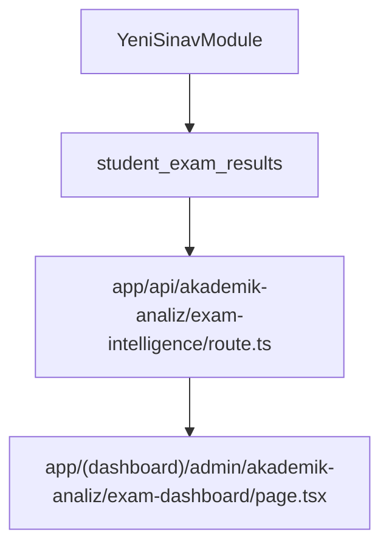

# Exam Intelligence Platform – Uygulama Planı (Minimum Maliyet, Maksimum Etki)

## Hedef ve Kısıtlar

- Hedef: Var olan projede, “Yeni Sınav” modülünün ürettiği **`student_exam_results`** verisini baz alarak **ders kırılımı + trend** odaklı Exam Intelligence Dashboard’u güvenilir şekilde çalıştırmak.
- Kısıt: **Sınav okuma modülü (“Yeni Sınav”) asla silinmeyecek.** Mevcut URL/API yapıları korunacak. Maliyet düşük tutulacak.

## Mimari Akış (Tek Kaynak Veri)

## Aşama 0 — En Ucuz Doğrulama (Cursor: Ask + Debug)

- Amaç: “Yeni Sınav” sonrası **`student_exam_results` satırları gerçekten oluşuyor mu** ve **`subject_results` dolu mu**?
- Cursor modu:
- Ask: Kod okumayla hızlı yer tespiti
- Debug: Minimum log ile runtime doğrulama
- Kontrol listesi:
- `student_exam_results` içinde ilgili `exam_id` için kayıt var mı?
- `subject_results` alanı boş mu dolu mu?
- `exam_date`, `grade_level`, `organization_id` bilgisi `exams` üzerinden doğru mu?

## Aşama 1 — Veri Alanları “Kanonik” Hale Getirme (Cursor: Agent)

- Amaç: Dashboard’ın ihtiyaç duyduğu alanların **tek bir yerde** ve **tutarlı** olması.
- Sınav okuma modülü çıktısı için zorunlu alanlar (minimum):
- `student_exam_results.exam_id`
- `student_exam_results.student_no`
- `student_exam_results.student_name`
- `student_exam_results.class_name` (yoksa okuma modülü üretmeli)
- `student_exam_results.total_net`, `total_correct`, `total_wrong`, `total_empty`, `total_score`
- `student_exam_results.subject_results` (ders kırılımı için kritik)
- Uygulama yaklaşımı:
- “Yeni Sınav” sonuç yazma noktasında `subject_results`’un **her zaman** yazıldığını garanti et.
- Boş `subject_results` oluşuyorsa: kaynağı tespit et (kitapçık eşleme, soru aralığı, parsing) ve sadece o noktayı düzelt.

## Aşama 2 — Exam Intelligence API’yi “Sadece Okuyan + Korumalı” Hale Getirme (Cursor: Agent + Debug)

- Hedef dosya: [app/api/akademik-analiz/exam-intelligence/route.ts](app/api/akademik-analiz/exam-intelligence/route.ts)
- Yapılacaklar (minimum):
- `student_exam_results`’tan okunan `subject_results` boşsa:
    - Sessiz fallback yapmadan `metadata.warnings[]` içine uyarı yaz.
- Trend için “son N sınav” sorgusu:
    - Aynı `organization_id` + aynı `grade_level`
    - `exams.exam_date` sıralı
- Performans maliyeti kontrolü:
    - Trend hesaplarında mümkün olduğunca az sorgu (ör. son 5-10 sınav)
- Cursor modu:
- Agent: Kod değişikliği
- Debug: Örnek bir sınavda response içinde `statistics.bySubject` ve `statistics.trends` dolu mu?

## Aşama 3 — Exam Dashboard UI: “Ders + Trend” Odaklı Stabilizasyon (Cursor: Agent)

- Hedef dosya: [app/(dashboard)/admin/akademik-analiz/exam-dashboard/page.tsx](app/\\(dashboard)/admin/akademik-analiz/exam-dashboard/page.tsx)
- MVP gereksinimi (seçiminize göre):
- Ders grafikleri **`statistics.bySubject`** üzerinden
- Trend grafiği **`statistics.trends`** üzerinden
- Yapılacaklar (minimum):
- Boş durumlarda net mesaj:
    - `bySubject` boşsa: “Bu sınavda ders kırılımı verisi yok (subject_results boş olabilir).”
    - `trends` < 2 ise: “Trend için yeterli sınav yok.”
- UI davranışını bozmadan sadece veri kaynağı ve boş durum metinleri

## Aşama 4 — “Yeni Sınav” ile Entegrasyon Testi (Cursor: Debug)

- Amaç: Üretim benzeri akışta doğrulama.
- Senaryo:
- Yeni sınav yükle
- `student_exam_results` yazıldı mı?
- Exam Dashboard’da ders kırılımı ve trend göründü mü?
- Debug çıktıları:
- API response `metadata.warnings` boş mu?
- `statistics.bySubject.length > 0` mı?
- `statistics.trends.length > 1` mi?

## Aşama 5 — Maliyet Kontrolü ve Kademeli Yayın (Cursor: Plan + Ask)

- Amaç: “Az para ile sürdürülebilir” şekilde büyütmek.
- Strateji:
- Önce sadece “detailed” derinlik (basic/comprehensive sonra)
- Trend penceresini default 5 yap
- Büyük okullarda performans için tablo sayfalama/limit

## Cursor Mod Rehberi (Net Kullanım)

- Plan: Bu planı kilitlemek ve scope’u dondurmak
- Ask: Hızlı kod/klasör tespiti, nerede ne var görmek
- Agent: Sadece gerekli dosyada küçük, kontrollü değişiklik
- Debug: Runtime kanıt (log/response) ile “gerçekten çalıştı” doğrulaması

## Uygulama Notları (Sınav Okuma Modülü Korunur)

- “Yeni Sınav” modülü **silinmez**.